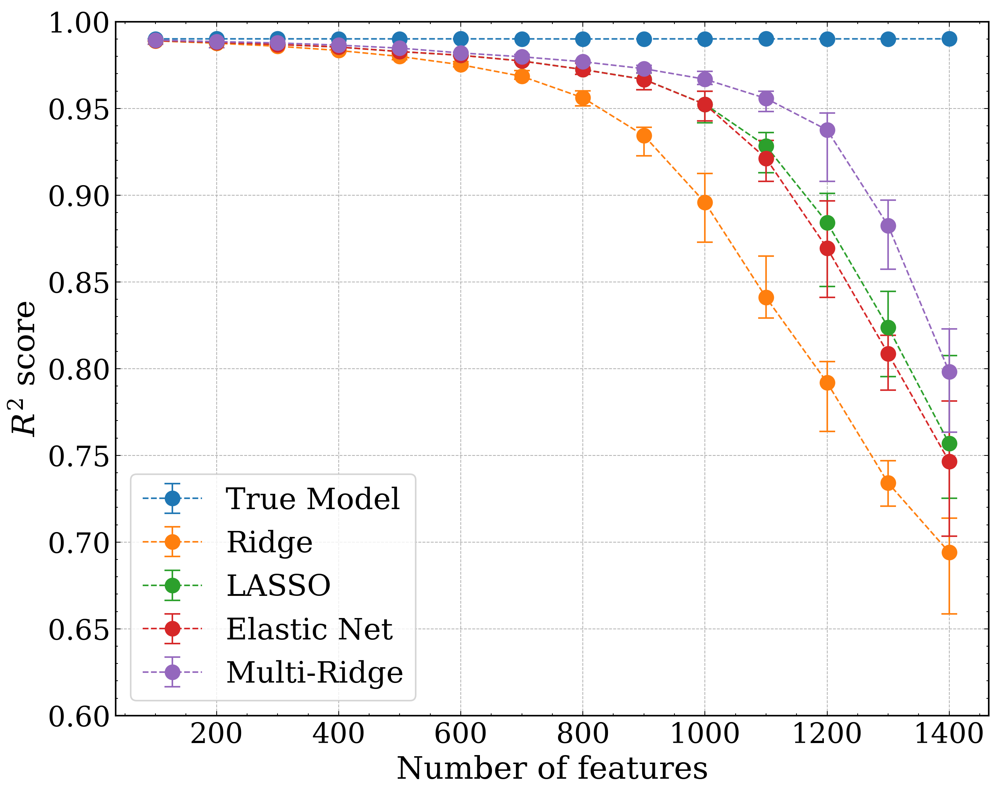

# Gradient-based bilevel optimization for multi-penalty ridge regression through matrix differential calculus

This github repository contains the Python code to reproduce the results of the paper Gradient-based bilevel optimization for multi-penalty ridge regression through matrix differential calculus by Gabriele Maroni, Loris Cannelli and Dario Piga.

This paper has been submitted for publication in *Automatica Journal*.




## Abstract
Common regularization algorithms for linear regression, such as LASSO and Ridge regression, rely on a regularization hyperparameter that balances the tradeoff between minimizing the fitting error and the norm of the model coefficients. As this hyperparameter is scalar, it can be easily  selected via random or grid search optimizing a cross-validation criterion. However, using a scalar hyperparameter limits the algorithm's degrees of freedom. In this paper, we address the problem of linear regression with  $\ell_2$-regularization, where a different regularization hyperparameter is associated with each input variable. We optimize these hyperparameters using a gradient-based approach, wherein the gradient of a cross-validation criterion with respect to the regularization hyperparameters is computed analytically through matrix differential calculus. Additionally, we introduce two strategies tailored for sparse model learning problems aiming at reducing the risk of overfitting to the validation data. Numerical examples demonstrate that our multi-hyperparameter regularization approach outperforms LASSO, Ridge, and Elastic Net regression. Moreover, the analytical computation of the gradient proves to be more efficient in terms of computational time compared to automatic differentiation, especially when handling a large number of input variables. Application to the identification of over-parameterized Linear Parameter-Varying models is also presented.

## Software implementation
All the source code used to generate the results and figures in the paper are in the `src` and `notebooks` folders. Computations and figure generation are all run inside [Jupyter notebooks](http://jupyter.org/). Results generated by the code are saved in `results` folder.

## Getting the code
You can download a copy of all the files in this repository by cloning the
[git](https://git-scm.com/) repository:

    git clone https://github.com/pinga-lab/PAPER-REPO.git

or [download a zip archive](https://github.com/pinga-lab/PAPER-REPO/archive/master.zip).

## Requirements
You'll need a working Python environment to run the code.
The recommended way to set up your environment is through the
[Anaconda Python distribution](https://www.anaconda.com/download/) which
provides the `conda` package manager.
Anaconda can be installed in your user directory and does not interfere with
the system Python installation.
The required dependencies are specified in the file `requirements.txt`.

We recommend to use `conda` virtual environments to manage the project dependencies in
isolation.
Thus, you can install the dependencies without causing conflicts, with your
setup (even with different Python versions), with the pip package-management system.

Run the following command in the repository folder (where `requirements.txt`
is located) to create a separate environment and install all required
dependencies in it:

    conda create --name <env_name>
    pip install -r requirements.txt

## Reproducing the results


## Citation

If you use this code or our findings in your research, please cite:

\```
@article{authorlastname2023title,
  title={Full Title of the Paper},
  author={Author, Firstname and Coauthor, Firstname},
  journal={Journal Name},
  year={2023},
  url={Link to paper if available}
}
\```

## License

This project is licensed under the terms of the MIT license.


